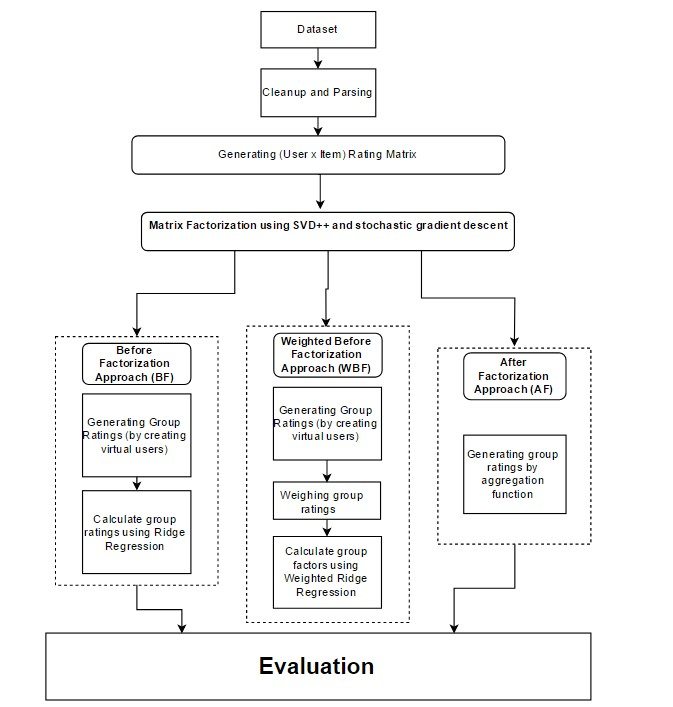

# Group-movie-recommender-system
In this project, we create a matrix factorization based Recommender System for a group of users.
We first carry out Stochastic Gradient based Matrix Factorization of user-movie rating matrix to
calculate user and movie factors.

We generate groups of users of 3 different sizes. Small (3 members), Medium(5 members) and Large
(10 members) and predict group ratings using methods described below.

We try out 3 different methods.
<li> After Factorization: where we aggregate factors of users into group factors after factorization </li>
<li> Before Factorization(BF): where we aggregate users' ratings into a virtual user. We calculate
     group factors by using simple ridge regression. </li>
<li> Weighted Before Factorization(WBF): Same as BF except that no. of movies watched by users are taken
    as weights. We solve it using weighted ridge regression method. </li>
    
Finally we evaluate our project (getting roughly 80 % precision)

## Paper
Project is based on the following paper:

http://www.sciencedirect.com/science/article/pii/S0020025516300196

## Dataset
Dataset: https://grouplens.org/datasets/movielens/100k/

## Video
Video: https://www.youtube.com/watch?v=ycf2sY2XnN8

## Execution Dependencies
The notebook can be run directly.
Dataset is included in the github repo.
Also, the python code can be run by: 
```
python ./GroupRec.py
```

We are using pandas, numpy, scipy and warnings modules. Install them by
running.
```
pip install numpy
pip install pandas
pip install scipy
```
The arguments are taken via a config file config.conf that is present in the
same folder. The hyperparameters for matrix factorization, group sizes and
no. of generated groups can be changed through the config file.

Note: Since the notebook uses relative paths for dataset and images in res/
subdirectory, please run in the same folder when it is cloned from repo.

## Flowchart



